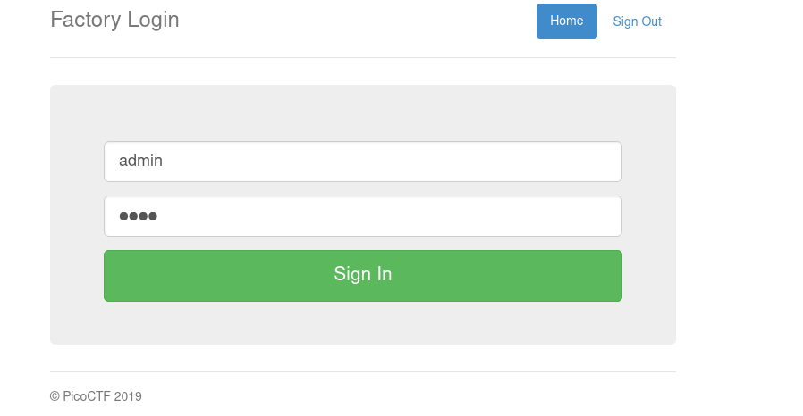
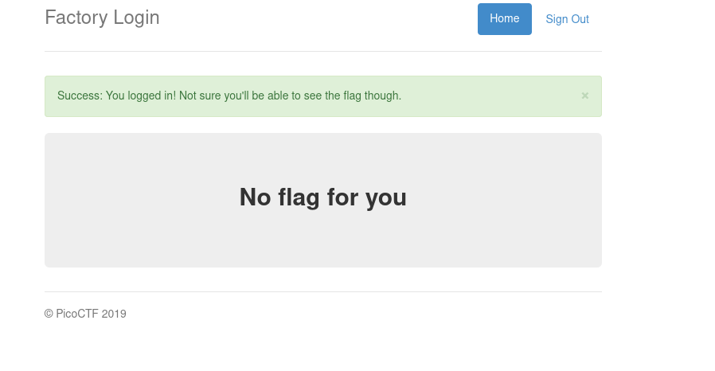
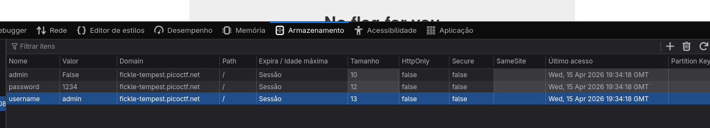

De começo temos um site de login

Após tentamos logar

Abrindo o cookies de sessão, temos:

Verificamos que temos um cookies chamado `admin`que está como `False`, após alterar o valor de `False`pra `True`.

Temos a flag

           +--------------+
          /|             /|
         / |            / |
        *--+-----------*  |
        |  |           |  |
        |  |           |  |
        |  |           |  |
        |  +-----------+--+
        | /            | /
        |/             |/
        *--------------* MG.
